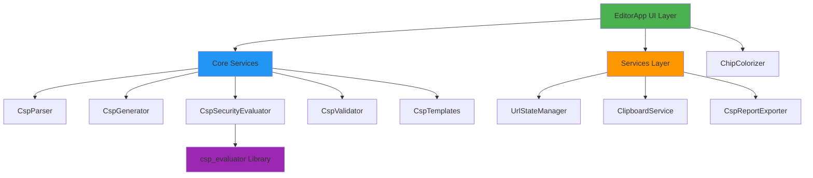
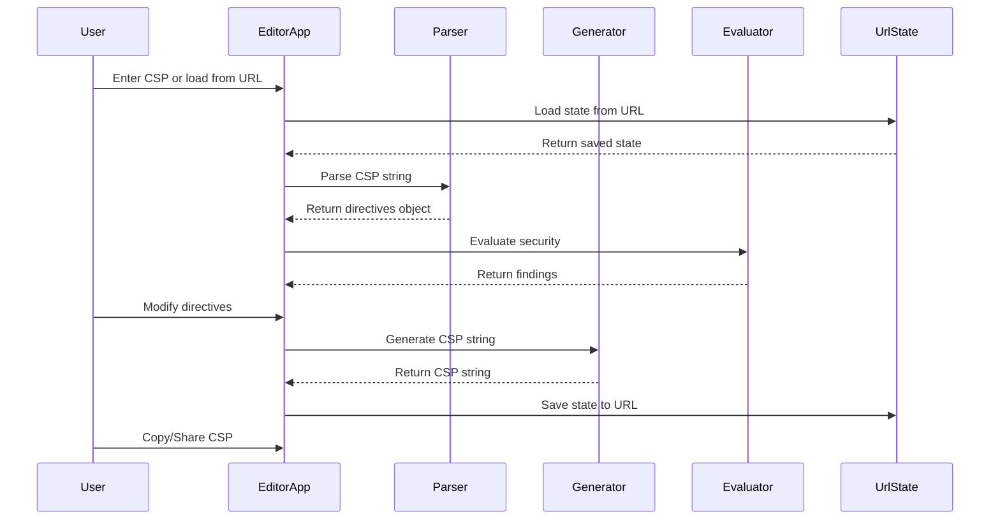
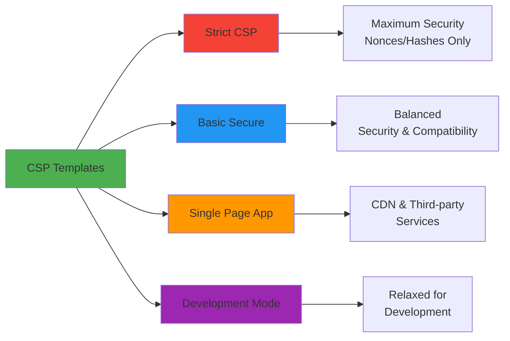

# Visual CSP Editor

A visual editor for Content Security Policy (CSP) headers with real-time security evaluation and shareable configurations.

Visit https://visual-csp.pages.dev

## Features

- **Visual CSP Editing**: Intuitive interface for creating and editing CSP directives
- **Security Evaluation**: Real-time security analysis powered by Google's CSP Evaluator
- **Templates**: Pre-configured CSP policies for common use cases (Strict, Basic, SPA, etc.)
- **URL State Management**: Share CSP configurations via compressed URLs
- **Export Reports**: Generate detailed security reports in JSON format
- **Dark Mode**: Built-in theme switching with system preference detection
- **Validation**: Real-time validation of directive names and values
- **Copy to Clipboard**: Quick copy of CSP headers and shareable links

## Architecture

The project follows SOLID principles with clear separation of concerns:



### Core Components

#### Core Layer (`src/core/`)
- **CspParser**: Parses CSP strings into structured directives
- **CspGenerator**: Generates CSP strings from directives
- **CspSecurityEvaluator**: Evaluates security using Google's CSP Evaluator
- **CspValidator**: Validates directive names and values
- **CspTemplates**: Provides predefined CSP templates

#### Services Layer (`src/services/`)
- **UrlStateManager**: Handles URL state serialization/compression
- **ClipboardService**: Manages clipboard operations
- **CspReportExporter**: Exports security reports

#### UI Layer (`src/ui/`)
- **EditorApp**: Main Alpine.js component orchestrating the UI
- **ChipColorizer**: Handles visual styling of CSP values

## 🔄 CSP Processing Flow



## 📦 Project Structure

```
visual-csp-editor/
├── src/
│   ├── core/              # Core business logic
│   │   ├── CspGenerator.ts
│   │   ├── CspParser.ts
│   │   ├── CspSecurityEvaluator.ts
│   │   ├── CspTemplates.ts
│   │   ├── CspValidator.ts
│   │   ├── types.ts       # TypeScript interfaces
│   │   └── index.ts
│   ├── services/          # Application services
│   │   ├── ClipboardService.ts
│   │   ├── CspReportExporter.ts
│   │   ├── UrlStateManager.ts
│   │   └── index.ts
│   ├── ui/                # UI components
│   │   ├── ChipColorizer.ts
│   │   ├── EditorApp.ts
│   │   └── index.ts
│   ├── main.ts            # Application entry point
│   └── style.css          # Tailwind styles
├── tests/                 # Unit tests
├── docs/                  # Documentation
├── index.html             # HTML template
├── package.json
├── tsconfig.json
├── vite.config.ts
└── vitest.config.ts
```

## Getting Started

### Prerequisites

- Node.js 16+ 
- npm or yarn

### Installation

```bash
# Clone the repository
git clone https://github.com/teles/visual-csp-editor.git

# Navigate to project directory
cd visual-csp-editor

# Install dependencies
npm install
```

### Development

```bash
# Start development server
npm run dev

# Run tests
npm test

# Run tests in watch mode
npm run test:watch

# Run tests with coverage
npm run test:coverage

# Lint code
npm run lint

# Fix linting issues
npm run lint:fix
```

### Build

```bash
# Build for production
npm run build

# Preview production build
npm run preview
```

## Testing

The project uses Vitest for unit testing with comprehensive coverage:

- All core services are fully tested
- UI components are tested in isolation
- Mock implementations for external dependencies

Run tests with:
```bash
npm test
```

## CSP Templates

The editor includes predefined templates for common scenarios:



### Available Templates

1. **Strict CSP**: Maximum security using nonces/hashes only
2. **Basic Secure**: Good balance of security and compatibility
3. **Single Page App**: For SPAs using CDNs and third-party services
4. **Development Mode**: Relaxed policy for development (not for production!)

## 🔒 Security Evaluation

The editor uses Google's [CSP Evaluator](https://github.com/google/csp-evaluator) library to provide real-time security analysis. Findings are categorized by severity:

- **High**: Critical security issues that should be fixed immediately
- **Medium**: Important issues that weaken security
- **Info**: Informational messages and best practices

## Technology Stack

- **TypeScript**: Type-safe development
- **Vite**: Fast build tool and dev server
- **Alpine.js**: Lightweight reactive framework
- **Tailwind CSS**: Utility-first CSS framework
- **csp_evaluator**: Google's CSP security evaluator
- **pako**: Compression for URL state
- **Vitest**: Fast unit testing framework

## CSP Directives

The editor supports all standard CSP directives including:

- `default-src`, `script-src`, `style-src`
- `img-src`, `font-src`, `connect-src`
- `frame-src`, `object-src`, `media-src`
- `worker-src`, `manifest-src`
- `form-action`, `frame-ancestors`, `base-uri`
- `upgrade-insecure-requests`, `block-all-mixed-content`
- And more...

## Contributing

Contributions are welcome! Please feel free to submit a Pull Request.

1. Fork the repository
2. Create your feature branch (`git checkout -b feature/AmazingFeature`)
3. Commit your changes (`git commit -m 'Add some AmazingFeature'`)
4. Push to the branch (`git push origin feature/AmazingFeature`)
5. Open a Pull Request

## Acknowledgments

- [Google CSP Evaluator](https://github.com/google/csp-evaluator) for security analysis
- [Alpine.js](https://alpinejs.dev/) for reactive UI framework
- [Tailwind CSS](https://tailwindcss.com/) for styling

## Learn More

- [Content Security Policy (CSP) - MDN](https://developer.mozilla.org/en-US/docs/Web/HTTP/CSP)
- [CSP Specification](https://www.w3.org/TR/CSP3/)
- [CSP Best Practices](https://csp.withgoogle.com/docs/index.html)

---

Made with ❤️ for better web security
